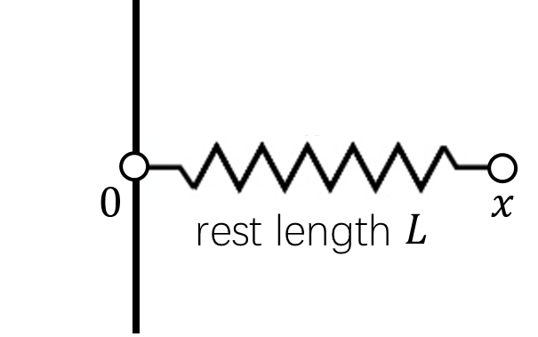
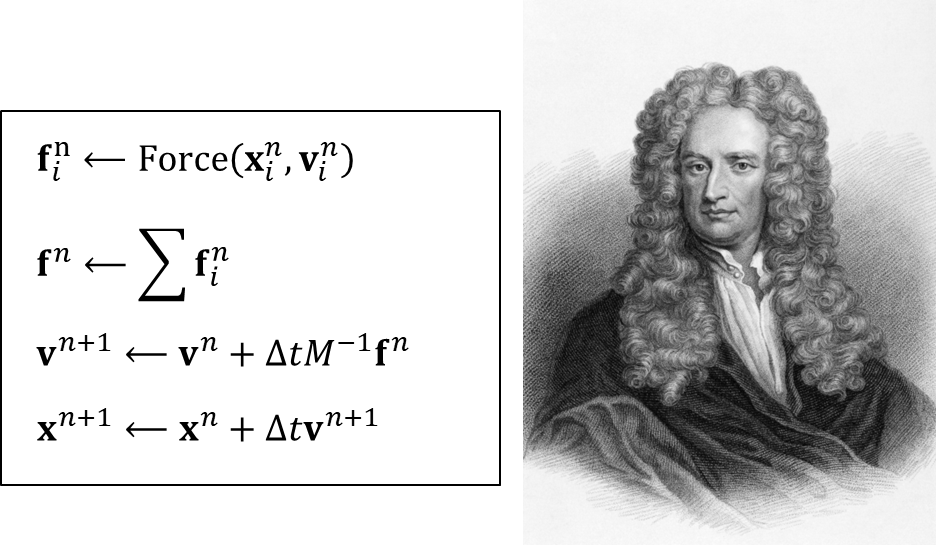
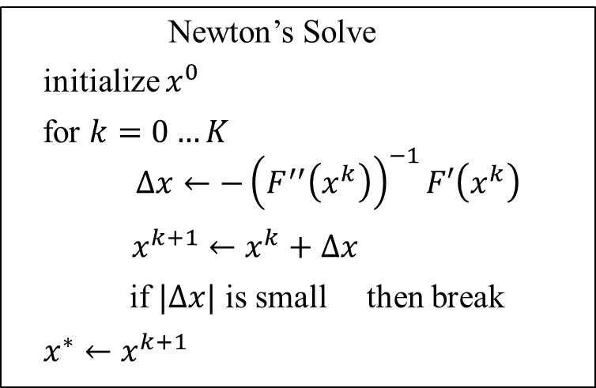
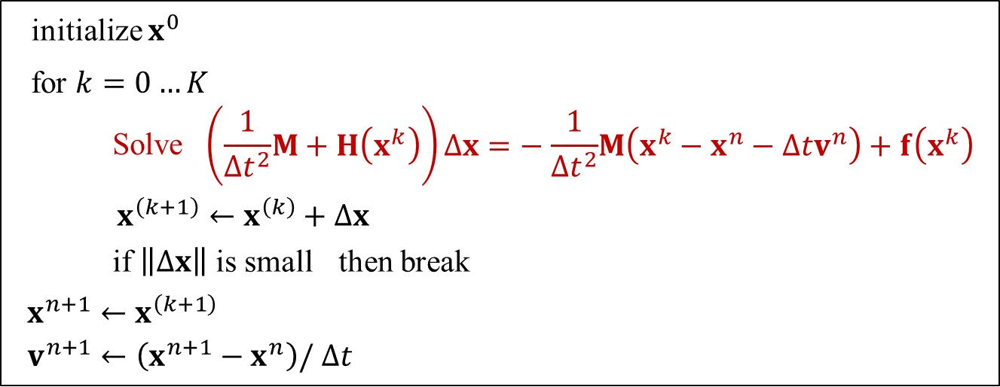
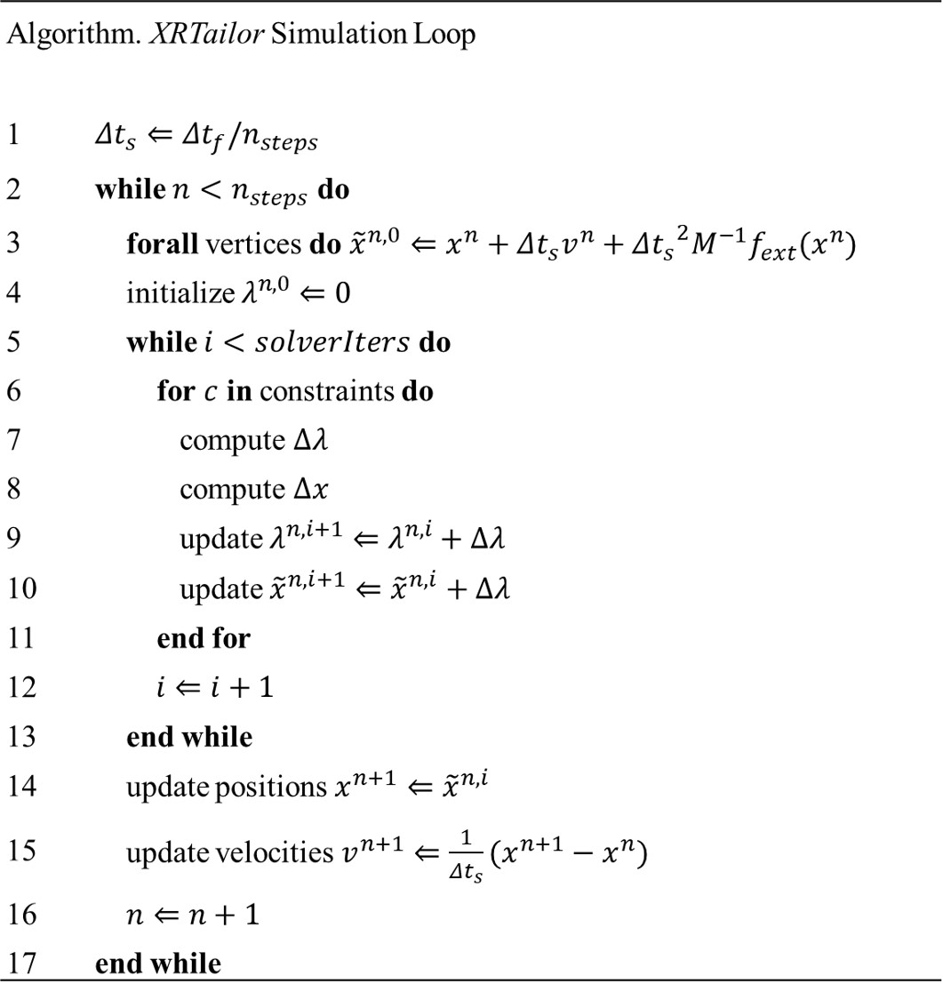

# Mass-Spring System

- [Symbols](md-symbols)
- [Background](md-background)
- [Position-Based Dynamics](md-position-based-dynamics)
- [Appendix](md-appendix)
- [References](md-references)

In this section, we first revisit the problem formulation of clothing dynamics and then introduce how *XRTailor* integrates it.

(md-symbols)=

## Symbols

$\nabla X$: Gradient of $X$

$\dot{X}$: First derivative of $X$

$\ddot{X}$: Second derivative of $X$

(md-background)=

## Background

### Mass-Spring System

The cloth is usually considered as a mass-spring system. An ideal spring satisfies Hooke's law: the spring force tries to restore the rest length.

<div style="text-align: center;">
  
  <p><em>Simple Spring</em></p>
</div>

The system has the following energy potential:

```{math}
E(x) = \frac{1}{2} k (x-L)^2 \tag{1}
```

The force is evaluated by the negative gradient of the energy:

```{math}
f(x) = - \nabla E(x) = - k (x-L) \tag{2}
```

### Explicit Integration

Physics-based simulation integrate the system evolving in time according to Newton’s laws of motion. 

<div style="text-align: center;">
  
  <p><em>Explicit Integration</em></p>
</div>

The simplest way to integrate clothing dynamics is Explicit Euler integration: 
    
1. Compute internal and external forces:

```{math}
f^{n} = Force(x^{n}, v^{n}) \tag{3}
```

2. Update velocities using forces:

```{math}
v^{n+1} = v^{n} + \Delta t m^{-1} f^{n} \tag{4}
```

3. Update positions using velocities:

```{math}
x^{n+1} = x^{n} + \Delta t v^{n+1} \tag{5}
```

This method is easy to implement, but it suffers from the ***overshooting*** problem when a large time step is selected. Using a small time step increases the computational burden. Hence, explicit integration is usually not a practical choice for clothing dynamics.

### Implicit Integration

Due to the limitations of explicit integration, implicit Euler integration is proposed. The method reformulates the system as an optimization problem, which is a more robust alternative and produces accurate and realistic clothing mechanics. 

#### Problem Formulation

Implicit integration integrates both $x$ and $v$ implicitly:

```{math}
\begin{equation}
\begin{cases}
v^{n+1} = v^{n} + \Delta t M^{-1} f^{n+1} \\
x^{n+1} = x^{n} + \Delta t v^{n+1}
\end{cases}
\tag{6}
\end{equation}
```

Unlike explicit integration, which evaluates forces using the current step $f^{n}$, implicit integration evaluates forces using the next step $f^{n+1}$. Therefore, we cannot get an analytical solution for equations (6, 7).

Assuming that $f$ is holonomic, i.e., depending on $x$ only, the question is how to solve the following equation:

```{math}
x^{n+1} = x^{n} + \Delta t v^{n} + \Delta t^2 M^{-1} f(x^{n+1}) \tag{7}
```

which is equivalent to the following non-linear optimization problem:

```{math}
\begin{equation}
\begin{cases}
x^{n+1} = argmin F(x) \\
F(x) = \frac{1}{2\Delta t^2}||x-x^{n}-\Delta tv^{n}||^2_M + E(x)
\end{cases}
\tag{8}
\end{equation}
```

***Proof.***

```{math}
\nabla F(x^{n+1}) = \frac{1}{\Delta t^2} M (x^{n+1} - x^{n} - \Delta t v^{n}) - f(x^{n+1}) = 0 \tag{9}
```

```{math}
x^{n+1} - x^{n} - \Delta t v^{n} - \Delta t^2 M^{-1}f(x^{n+1}) = 0 \tag{10}
```

which is the same as equation (7).

#### Newton's Solve

The Newton-Raphson method, commonly known as Newton's method, solves the optimization problem $x^* = argmin F(x)$ where $F(x)$ is Lipschitz continuous. The problem is equivalent to finding the root of $F^{'}(x) = 0$. Given a current $x^{k}$, we approximate our goal by:

```{math}
F^{'}(x) \approx F^{'}(x^{k}) + F^{''}(x^{k})(x-x^{k}) = 0 \tag{11}
```

Then, we employ Newton's method to iteratively solve for $x^*$ such that $F'(x^*)=0$:

<div style="text-align: center;">
  
  <p><em>Newton's Solve</em></p>
</div>

Specifically, we have the first and second derivatives of $F(x)$:

```{math}
\begin{equation}
\begin{cases}
\nabla F(x^{k}) = \frac{1}{\Delta t^2} M (x^{k} - x^{n} - \Delta t v^{n}) - f(x^{k}) = 0 \\
\frac{\partial F^2(x^{k})}{\partial x^2} = \frac{1}{\Delta t^2}M + H(x^{k})
\end{cases}
\tag{12}
\end{equation}
```

The algorithm comes to:

<div style="text-align: center;">
  
  <p><em>Newton's Method for Implicit Integration</em></p>
</div>

Solving such a large, sparse, non-linear system is complex and computationally expensive since we need to evaluate $H(x^{n})$ in equation (12), which is called the ***Hessian***. Therefore, implicit integration is rarely used in real-time applications.

(md-position-based-dynamics)=

## Position-Based Dynamics

### Methodology

The position-based approach directly modifies vertex positions instead of evaluating forces. Hence, it does not need to solve for the *Hessian*. We first revisit the problem from the energy potential and Newton's equations of motion. Then we introduce how the position-based approach works.

The system has an energy potential $U(x)$, where $x=[x_1, x_2, ..., x_n]^T$ represents the system state using vertex coordinates. The elastic energy potential $U$ is:

```{math}
U = \frac{1}{2} k \Delta x^2 \tag{13}
```

where $k$ is the spring constant representing stiffness; $\Delta x$ represents the extension, i.e., how far the vertex moves beyond the rest position. For a single constraint $C_1$, its potential energy has the following form:

```{math}
U(x) = \frac{1}{2} k C_{1} (x)^2 \tag{14}
```
For a system with $m$ constraints, it can be written in matrix form:

```{math}
U(x) = \frac{1}{2} C^T(x) \alpha^{-1} C(x) \tag{15}
```

where $C(x) = [C_{1}(x), ..., C_{m}(x)]^T$ is the constraint column vector; $\alpha$ is a block diagonal compliance matrix corresponding to the inverse of stiffness $k_1, ..., k_m$.

According to Newton's equations of motion:

```{math}
f_{elastic}^{T} = M \ddot{x} \tag{16}
```

Substituting equation (15) into (16), we have:

```{math}
M \ddot{x} = - \nabla U^T = -\nabla C^T(x) \alpha^{-1} C(x) \tag{17}
```

in which $M$ is a diagonal mass matrix of cloth vertices.

We use the implicit Euler method to perform time discretization on equation (17):

```{math}
M(\frac{x^{n+1} - 2x^n + x^{n-1} }{\Delta t^2}) = - \nabla U^T(x^{n+1}) \tag{18}
```

where $\alpha$ is a block diagonal matrix representing inverse stiffness. For more details, please refer to [Appendix: Implicit Euler Time Discretization](implicit-euler-time-discretization). The equation can be simplified as:

```{math}
M(\frac{x^{n+1} - \tilde{x} }{\Delta t^2}) = - \nabla C^T(x^{n+1}) \alpha^{-1} C(x^{n+1}) \tag{19}
```

where $n$ represents the iteration count; $\tilde{x} = 2 x^n - x^{n-1} = x^n + v^n \Delta t$ is the **predicted** position. The elastic force $f_{elastic}$ is evaluated by the gradient of the energy potential $U(x)$:

```{math}
f_{elastic} = - \nabla U(x) = - \nabla C^T(x) \alpha^{-1} C(x) \tag{20}
```
XPBD converts it into a constrained problem by introducing a Lagrange multiplier:

```{math}
\lambda_{elastic} = - \tilde{\alpha}^{-1} C(x) \tag{21}
```

where $\lambda_{elastic} = [\lambda_{1}, ..., \lambda_{m}]^{T}$ represents the vector of constraint multipliers; $\tilde{\alpha} = \frac{\alpha}{\Delta{t}^{2}}$ is the compliance matrix.

Substituting $\lambda$ into equation (19, 20), we have the discrete constrained equations of motion and label them as $g$ and $h$, respectively:

```{math}
\begin{equation}
\begin{cases}
g(x, \lambda) = M(x^{n+1} - \tilde{x}) - \nabla C(x^{n+1})^T \lambda^{n+1} = 0 \\
h(x, \lambda) = C(x^{n+1}) + \tilde{\alpha} \lambda^{n+1} = 0
\end{cases}
\tag{22}
\end{equation}
```

Our goal is to find $x$ and $\lambda$ that satisfy:

```{math}
\begin{equation}
\begin{cases}
g(x, \lambda) = 0 \\
h(x, \lambda) = 0
\end{cases}
\tag{23}
\end{equation}
```

Linearizing equations (23), we obtain the following linear Newton subproblem. Notice that we omit the superscript $(n+1)$ that represents the time step; to emphasize per-iteration unknowns we use the subscript $(i)$. For more information on the linearization, please refer to [Appendix: Linearization of g and h](linearization-of-g-and-h). The linearized equation becomes:

```{math}
\begin{equation}
\begin{bmatrix}
\mathbf{K} & -\nabla C^{T}(x_i) \\
\nabla C(x_i) & \tilde{\alpha}
\end{bmatrix}
\begin{bmatrix}
\Delta x \\
\Delta \lambda
\end{bmatrix}
= -
\begin{bmatrix}
g(x_i, \lambda_i) \\
h(x_i, \lambda_i)
\end{bmatrix}
\tag{24}
\end{equation}
```

where $K = \frac{\partial g}{\partial x}$ is related to the second derivative of energy, i.e., it has a *Hessian* term as in equation (12). The system can be solved for $\Delta x$ and the multiplier $\Delta \lambda$ accordingly:

```{math}
\begin{equation}
\begin{cases}
\lambda_{i+1} = \lambda_i + \Delta \lambda \\
x_{i+1} = x_i + \Delta x
\end{cases}
\tag{25}
\end{equation}
```

This iteratively updates $x$ and $\lambda$ that satisfy equation (23). However, as mentioned before, the evaluation of the *Hessian* is too expensive, and the system needs a line search algorithm to be robust. Therefore, XPBD makes two approximations to simplify the problem:

1. $K \approx M$, thus omitting geometric stiffness and Hessian terms. This approximation slows down the local convergence rate but does not change the global error.

2. $g(x_i, \lambda_i)=0$, which is trivially true for the first Newton iteration when initialized with $x_0 = \tilde x$ and $\lambda_0 = 0$.

The simplified problem is given by:

```{math}
\begin{equation}
\begin{bmatrix}
M & -\nabla C^{T}(x_i) \\
\nabla C(x_i) & \tilde{\alpha}
\end{bmatrix}
\begin{bmatrix}
\Delta x \\
\Delta \lambda
\end{bmatrix}
=
-
\begin{bmatrix}
0 \\
h(x_i, \lambda_i)
\end{bmatrix}
\tag{26}
\end{equation}
```

The problem can be written as a reduced system using a partition matrix (see [Appendix: Reduced System via Partition Matrix](reduced-system-via-partition-matrix)) or the Schur complement:

```{math}
[\nabla C(x_i)M^{-1} \nabla C^{T}(x_i) + \tilde{\alpha}] \Delta \lambda = - C(x_i) - \tilde{\alpha} \lambda_i \tag{27}
```

The positional update is given by:

```{math}
\Delta x = M^{-1} \nabla C^{T}(x_i) \Delta \lambda \tag{28}
```

Regarding the update for the Lagrange multiplier, if we take a single constraint with index $j$, $\Delta \lambda_{j}$ is given by:

```{math}
\Delta \lambda_{j} = \frac{ - C_j(x_i) - \tilde{\alpha_j} \lambda_{ij} }{ \nabla C_j(x_i)M^{-1} \nabla C_{j}^{T}(x_i) + \tilde{\alpha_j} } \tag{29}
```

If we set $\alpha_j = 0$, it degenerates to the scaling factor $s$ in classic PBD:

```{math}
s_j = \frac{- C_j(x_i) }{ \nabla C_j(x_i)M^{-1} \nabla C_{j}^{T}(x_i) } \tag{30}
```

and the $\Delta x$ comes to:

```{math}
\Delta x = k_j s_j M^{-1} \nabla C^{T}(x_i) \tag{31}
```

### Step Integration

In the PBD method, the cloth stiffness is related to the time step size and iteration count, which has limited use. We employed the XPBD scheme to update vertex positions in *XRTailor*. The overall algorithm that integrates clothing dynamics is:  

<div style="text-align: center;">
  
  <p><em>XRTailor Simulation Loop</em></p>
</div>

We incorporated the small-steps<sup><a href="#ref3">[3]</a></sup> technique to speed up the descent. We found that although using a large step size reduces stretchiness and achieves higher material stiffness, jittering or artifacts may occur during simulation. Hence, the step size is set to 1 in *Quality Mode* for stability and > 1 in *Swift Mode* for efficiency.

(md-appendix)=

## Appendix

### Implicit Euler Time Discretization

We have Newton's equation in continuous form in equation (17):

```{math}
M \ddot{x} = - \nabla U^T = -\nabla C^T(x) \alpha^{-1} C(x) \tag{32}
```

where $\ddot{x}$ represents acceleration and can be represented as the second derivative of $x$ by time $t$:

```{math}
\ddot{x} = \frac{\partial^2 x}{\partial t^2} \tag{33}
```

Assume that $x(t)$ is a function of time $t$; our goal is to estimate the value of $x$ at time $t^{n+1}$. We first linearize $x(t)$ using a Taylor expansion:

```{math}
x(t) = x(t^n) + (t - t^n)\dot{x}(t^n) + \frac{1}{2!} (t - t^n)^2 \ddot{x}(t^n) + ... \tag{34}
```

Substituting $t = t^n + \Delta t$, we have the discretized representation at $x(t^n + \Delta t)$:

```{math}
x(t^{n} + \Delta t) = x(t^n) + \dot{x}(t^n)\Delta t + \frac{1}{2} \ddot{x}(t^n) \Delta t^2 + ... \tag{35}
```

Similarly, substituting $t = t^n - \Delta t$, we have $x(t^n - \Delta t)$:

```{math}
x(t^{n} - \Delta t) = x(t^n) - \dot{x}(t^n)\Delta t + \frac{1}{2} \ddot{x}(t^n) \Delta t^2 + ... \tag{36}
```

We denote $x(t^n - \Delta t), x(t^n), x(t^n + \Delta t)$ as $x^{n-1}, x^n, x^{n+1}$ in the discretized representation; equations (35, 36) can be reformulated as:

```{math}
\begin{equation}
\begin{cases}
x^{n+1} = x^n + \dot{x}^n \Delta t + \frac{1}{2} \ddot{x}^n \Delta t^2 + ... \\
x^{n-1} = x^n - \dot{x}^n \Delta t + \frac{1}{2} \ddot{x}^n \Delta t^2 + ...
\end{cases}
\tag{37}
\end{equation}
```

Adding the two equations in (37), we have:

```{math}
\ddot{x}^{n} \approx \frac{ x^{n+1} - 2x^n + x^{n-1} }{\Delta t^2} \tag{38}
```

### Linearization of g and h

For an arbitrary non-linear equation $F(z) = 0$ where $z$ represents an unknown vector, it can be linearized using a Taylor expansion:

```{math}
F(z) \approx F(z_i) + (z - z_i)F^{'}(z_i) \tag{39}
```

Substituting $z = z^i + \Delta z$,

```{math}
F(z_i + \Delta z) \approx F(z_i) + F^{'}(z_i) \Delta z \tag{40}
```

Specifically, we have $F$ and $z$ in XPBD:

```{math}
\begin{equation}
\begin{cases}
F = \begin{bmatrix}
g(x, \lambda), h(x, \lambda) \\
\end{bmatrix}^T \\
z = \begin{bmatrix}
x, \lambda \\
\end{bmatrix}^T
\end{cases}
\tag{41}
\end{equation}
```

Linearize the equations at the current iteration step $(x_i, \lambda_{i})$:

```{math}
\begin{equation}
\begin{bmatrix}
g(x_i + \Delta x, \lambda_i + \Delta \lambda) \\
h(x_i + \Delta x, \lambda_i + \Delta \lambda)
\end{bmatrix}
\approx
\begin{bmatrix}
g(x_i, \lambda_i) \\
h(x_i, \lambda_i)
\end{bmatrix}
+
\begin{bmatrix}
\frac{\partial g}{\partial x} & \frac{\partial g}{\partial \lambda} \\
\frac{\partial h}{\partial x} & \frac{\partial h}{\partial \lambda}
\end{bmatrix}
\begin{bmatrix}
\Delta x \\
\Delta \lambda
\end{bmatrix}
= 0
\tag{42}
\end{equation}
```

which is equivalent to:

```{math}
\begin{equation}
\begin{bmatrix}
\frac{\partial g}{\partial x} & \frac{\partial g}{\partial \lambda} \\
\frac{\partial h}{\partial x} & \frac{\partial h}{\partial \lambda}
\end{bmatrix}
\begin{bmatrix}
\Delta x \\
\Delta \lambda
\end{bmatrix}
= -
\begin{bmatrix}
g(x_i, \lambda_i) \\
h(x_i, \lambda_i)
\end{bmatrix}
\tag{43}
\end{equation}
```

### Reduced System via Partition Matrix

The simplified problem is given by:

```{math}
\begin{equation}
\begin{bmatrix}
M & -\nabla C^{T}(x_i) \\
\nabla C(x_i) & \tilde{\alpha}
\end{bmatrix}
\begin{bmatrix}
\Delta x \\
\Delta \lambda
\end{bmatrix}
=
-
\begin{bmatrix}
0 \\
h(x_i, \lambda_i)
\end{bmatrix}
\tag{44}
\end{equation}
```

In partition matrix form:

```{math}
\begin{equation}
\left\{
\begin{array}{**lr**}
M \Delta x - \nabla C^{T}(x_i) \Delta \lambda = 0 & \\
\nabla C(x_i) \Delta x + \tilde{\alpha} \Delta \lambda = - h(x_i, \lambda_i) &
\end{array}
\right.
\tag{45}
\end{equation}
```

From the top equation, since the mass matrix $M$ can be inverted, we can obtain $\Delta x$:

```{math}
\Delta x = M^{-1} \nabla C^{T}(x_i) \Delta \lambda \tag{46}
```

Substituting $\Delta x$ and $h(x_i, \lambda_i)$ into the bottom equation, we get:

```{math}
[\nabla C(x_i)M^{-1} \nabla C^{T}(x_i) + \tilde{\alpha}] \Delta \lambda = - C(x_i) - \tilde{\alpha} \lambda_i \tag{47}
```

(md-references)=

## References

[1]: <span name = "ref1">https://games-cn.org/games103/</span>

[2]: <span name = "ref2">Macklin M, Müller M, Chentanez N. XPBD: position-based simulation of compliant constrained dynamics[C]//Proceedings of the 9th International Conference on Motion in Games. 2016: 49-54.</span>

[3]: <span name = "ref3">Macklin M, Storey K, Lu M, et al. Small steps in physics simulation[C]//Proceedings of the 18th Annual ACM SIGGRAPH/Eurographics Symposium on Computer Animation. 2019: 1-7.</span>