# Preparing Your Own Asset

- [Overview](md-overview)
- [Software Requirements](md-software-requirements)
- [Garment Generation](md-garment-generation)
- [UV Layout Adjustment](md-uv-layout-generation)
- [Setup Annotations](md-setup-annotation)
- [Test The Pipeline](md-test-the-pipeline)

This guide demonstrates how to create custom garment assets from scratch and integrate them into the simulation pipeline. We use the SMPL pipeline as an example throughout this tutorial.

(md-overview)=

## Overview

Creating a custom garment asset involves several key steps:
1. Setting up the required software tools
2. Generating the garment mesh
3. Adjusting UV layout for proper texturing behavior
4. Setting up annotations for simulation constraints
5. Testing the asset in the simulation pipeline

(md-software-requirements)=

## Software Requirements

The following softwares are required for the garment asset creation workflow:

| Software | Purpose | Version |
|----------|---------|---------|
| [Marvelous Designer](https://www.marvelousdesigner.com/) | Sewing pattern design and draping | 10 |
| [Unfold3D/RizomUV](https://www.rizomuv.com/) | UV layout manipulation to prevent texture stretching or overlapping | 9.0.2 |
| [MeshLab](https://www.meshlab.net/) | Post-processing, required for annotating constraint marker points and ensuring proper geometry info | 2022.02 |

(md-garment-generation)=

## Garment Generation

This section covers the process of creating a garment mesh from scratch using Marvelous Designer.

### Setup Mannequin

In XRTailor, all clothing deformations under different body shapes and poses are synthesized based on a shared garment template. The space where this template resides is called the **canonical space**. Since SMPL's human pose in the canonical space appears in T-pose form (θ=0, β=0), we define the garment under this state as the template.

To generate a garment template, a mannequin should be imported into Marvelous Designer first. The required mannequin can be found in the [XRTailor Assets](https://drive.google.com/file/d/1uIDpHj3IwgDJpAmNw_X30KlaJTOfRu4r/view?usp=sharing) under `Assets/Body/Template`.

#### Import Settings

Once your mannequin is ready, import it into Marvelous Designer with the following settings:
- **Scale**: `m` (meters)
- **Axis Conversion**: `(X, Y(Up), Z)`

The import dialog should look like:

<div style="text-align: center;">
  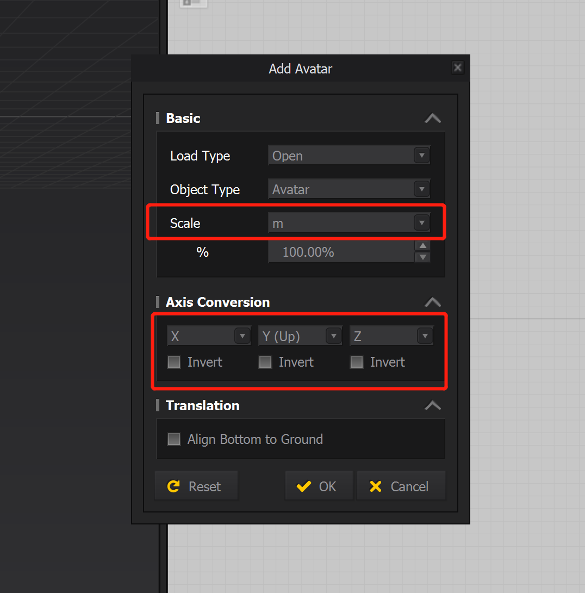
  <p><em>Avatar import settings</em></p>
</div>

The imported mannequin should appear as shown below:

<div style="text-align: center;">
  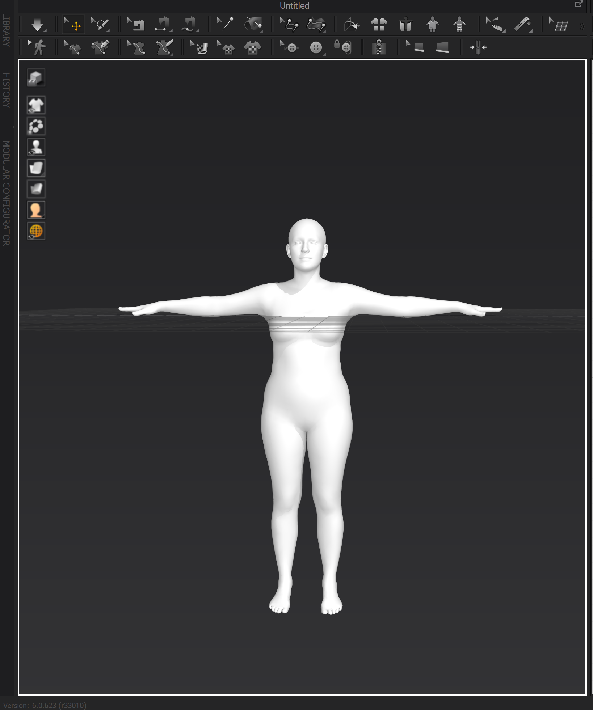
  <p><em>Imported mannequin</em></p>
</div>

#### Disable Ground Collision

Notice that there exists penetration between the avatar and the ground plane. To prevent simulation issues, disable ground collision by navigating to:
`Preferences → Simulation Properties → Ground → Collision`

<div style="text-align: center;">
  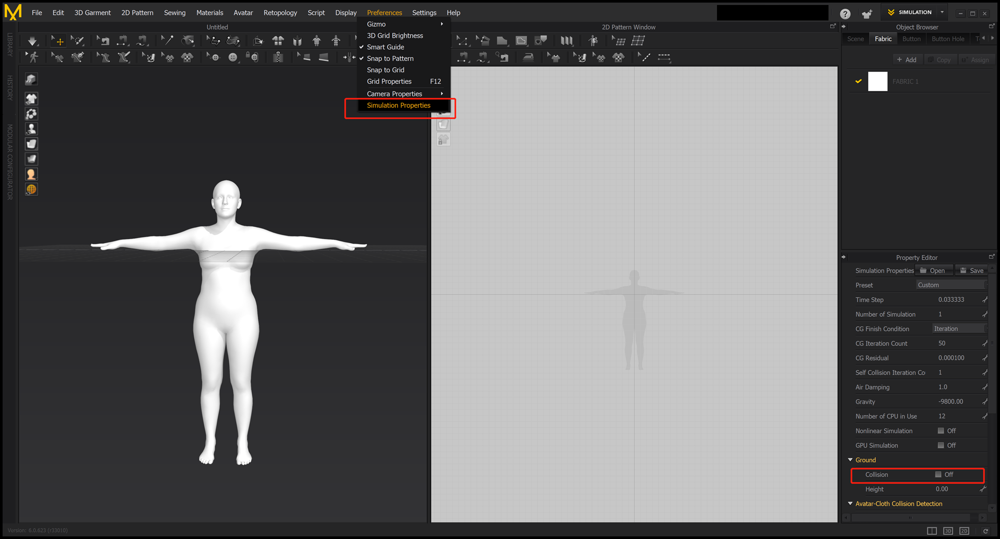
  <p><em>Ground collision settings</em></p>
</div>

#### Body Model Considerations

Since body meshes vary across genders and body models, garment templates must be created separately for each body model and gender combination:

- **SMPL and SMPL-H**: These bodies can be perfectly aligned in T-pose, eliminating the need for duplicate construction
- **SMPL-X**: Exhibits differences in T-pose (including mesh topology and global translation) compared to SMPL(H), requiring separate templates

### Sewing Pattern Design & Draping

This section covers creating garment patterns and simulating cloth draping on the mannequin.

#### Create Sewing Patterns

Design garment sewing patterns that are suitable for the target body. Use Marvelous Designer's pattern tools to create pieces that will form your garment:

<div style="text-align: center;">
  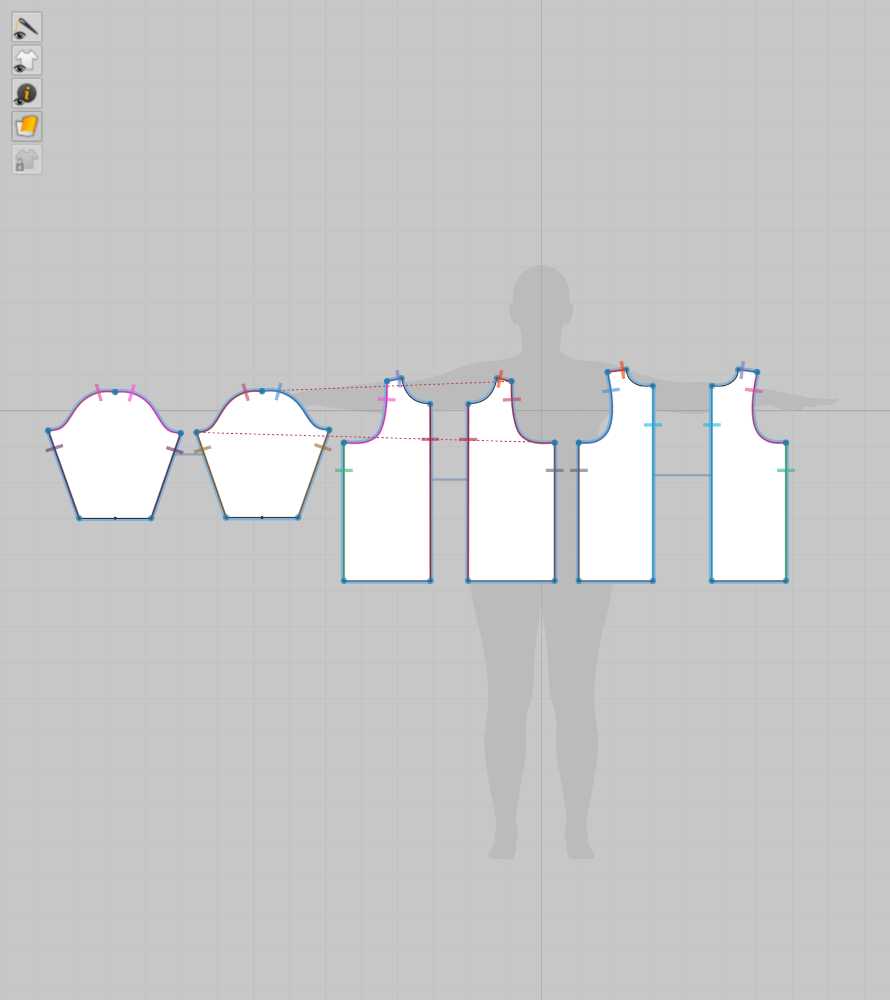
  <p><em>Example sewing patterns</em></p>
</div>

#### Position Cloth Pieces

In the 3D view, move the cloth pieces to appropriate positions so they are roughly aligned with the avatar. This initial positioning helps ensure proper draping during simulation:

<div style="text-align: center;">
  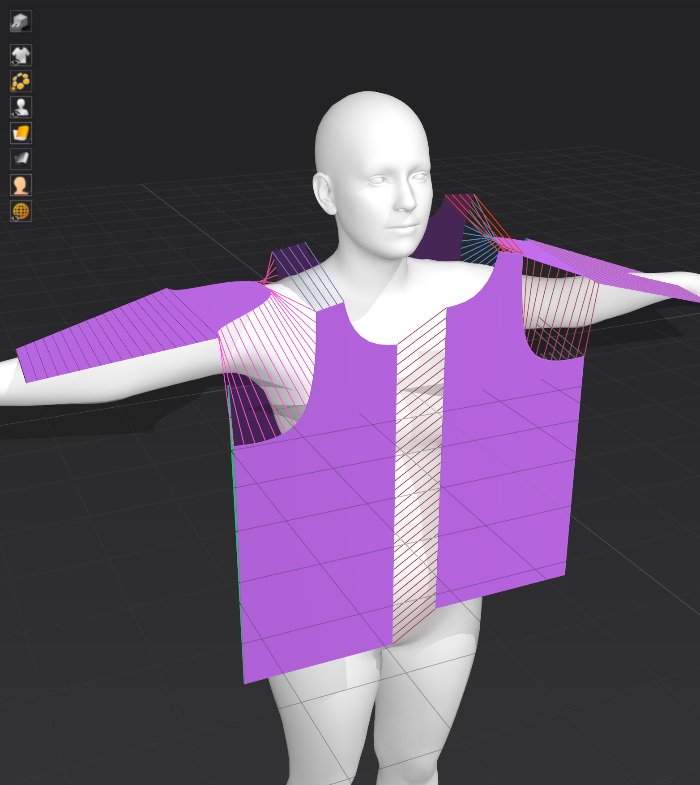
  <p><em>Positioning cloth pieces</em></p>
</div>

#### Stitch Sewing Lines

Connect the cloth pieces by stitching the sewing lines. This creates the garment structure and enables realistic draping simulation:

<div style="text-align: center;">
  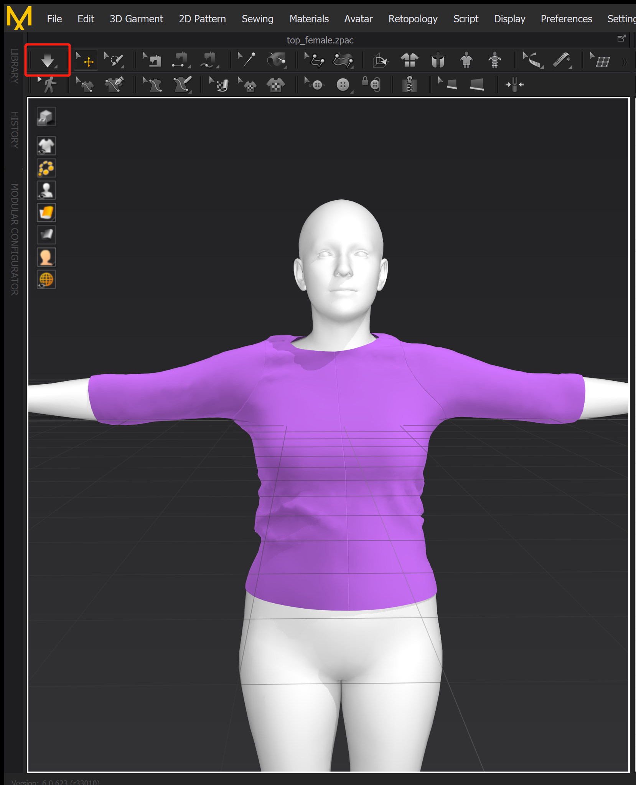
  <p><em>Stitched garment with draping simulation</em></p>
</div>

### Export

Once the garment is properly dressed onto the avatar, export it as an OBJ file for further processing:

1. Select all sewing patterns in the 2D view
2. Export the garment using `File → Export → OBJ(Selected)`:

<div style="text-align: center;">
  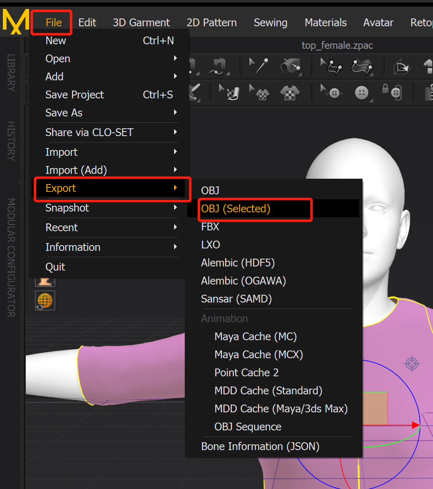
  <p><em>Export menu</em></p>
</div>

In the `Export OBJ` dialog, enable `Select All Patterns`, 
`Weld`, and `Thin`, set the `Scale` to `meters (m)`, configure 
`Axis Conversion` to `(X, Y(Up), Z)`:

<div style="text-align: center;">
  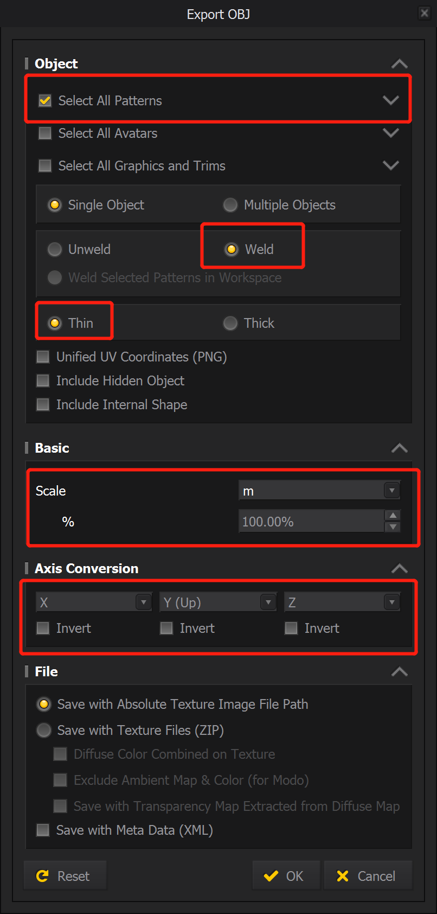
  <p><em>Export OBJ settings</em></p>
</div>

Click **OK** to export the garment as an `.obj` file.

(md-uv-layout-generation)=

## UV Layout Adjustment

After successfully creating a garment mesh in Marvelous Designer, the next step is to optimize the UV layout. Garments exported by Marvelous Designer often have intersecting UV islands and non-uniform scaling. We use Unfold3D to fix these issues.

### Import Garment

Load OBJ file using `Files → Load OBJ UV...`:

<div style="text-align: center;">
  
  <p><em>Loading OBJ file in Unfold3D</em></p>
</div>

The imported garment and its UV panel should appear as shown below:

<div style="text-align: center;">
  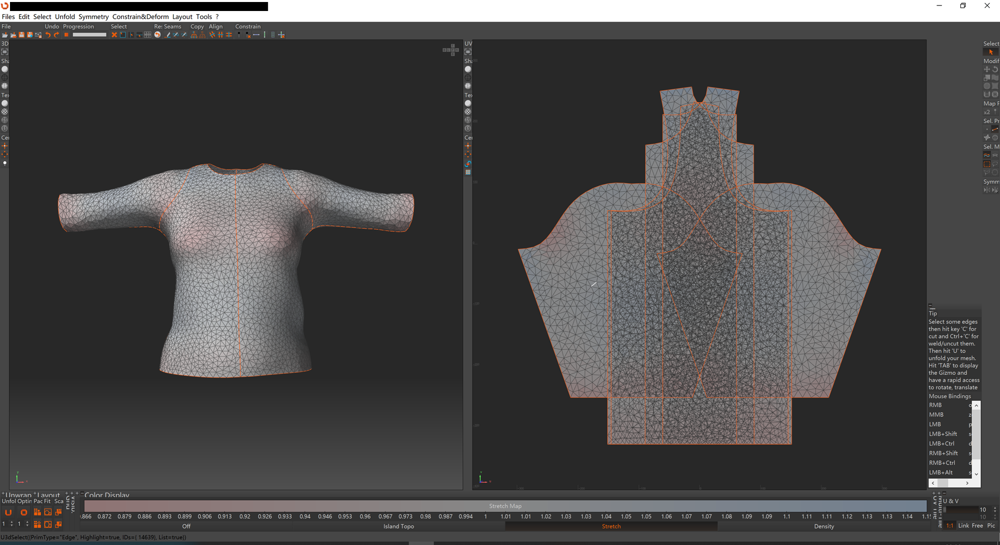
  <p><em>Imported garment with initial UV layout</em></p>
</div>

### Normalize UV Coordinates

Click the `Pack Translate` button to normalize the UV range to [0, 1] while preserving the orientation:

<div style="text-align: center;">
  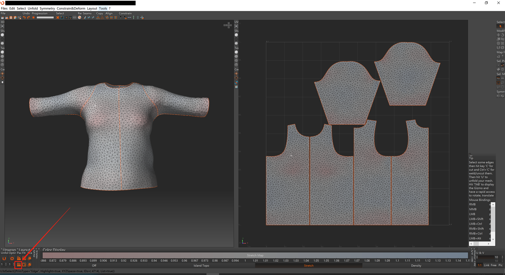
  <p><em>UV layout after Pack Translate operation</em></p>
</div>

### Manual UV Layout Adjustment

Manually adjust UV island positions in the UV layout panel to optimize texture space usage and prevent overlapping:

<div style="text-align: center;">
  
  <p><em>Manually adjusted UV layout</em></p>
</div>

### Export Garment

Export the garment mesh as an `.obj` file using `Files → Save OBJ As...`:

<div style="text-align: center;">
  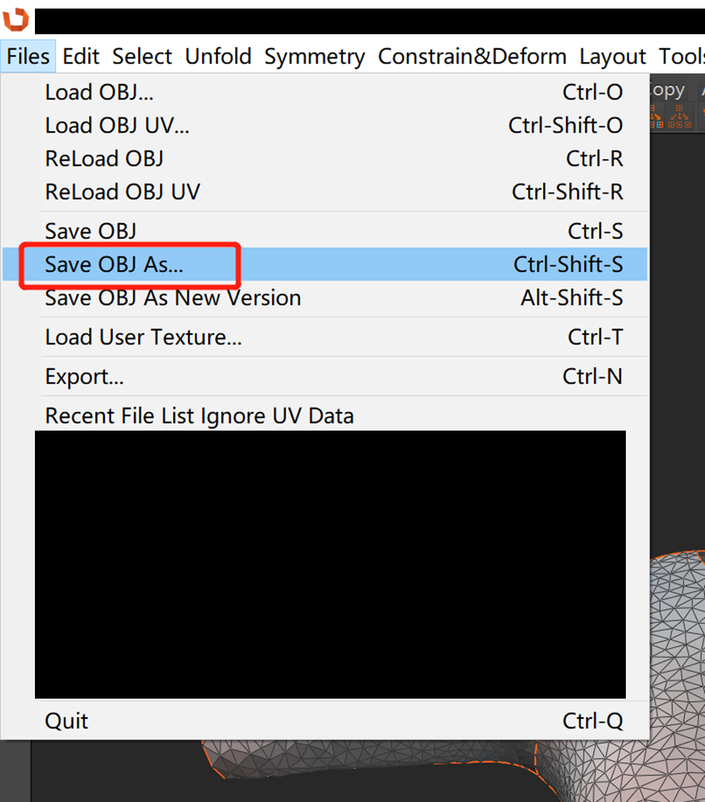
  <p><em>Export menu</em></p>
</div>

(md-setup-annotation)=

## Setup Annotations

XRTailor requires specific metadata to make garment assets functional in the simulation pipeline. The metadata requires the following key components:


- **STYLE**: Defines the garment type under certain naming convention
- **BINDING**: Specifies constraint points for simulation stability
- **ATTACHED_INDICES**: Sets reference point for long-range attachment (LRA)

### Style

The `STYLE` field must follow the `{PART}_{TYPE}_{GENDER}` naming convention:

| COMPONENT | DESCRIPTION | EXAMPLES |
|-----------|-------------|----------|
| **PART** | Body region covered by the garment | `upper`, `lower`, `full` |
| **TYPE** | Specific garment name | `hoody`, `shirt`, `mid-skirt`, `long-straight` |
| **GENDER** | Target gender | `male`, `female`, `neutral` |

Here are some style examples:

| PART | DESCRIPTION | EXAMPLE TYPE | EXAMPLE STYLE |
|:-----:|-------------|--------------|---------------|
| `upper` | Upper body garment | hoody, shirt | `upper_hoody_female`, `upper_shirt_neutral` |
| `lower` | Lower body garment | mid-skirt, long-straight | `lower_mid-skirt_female`, `lower_long-straight_male` |
| `full` | Full-body outfit | shift, drop-waist | `full_shift_female`, `full_drop-waist_neutral` |

### Binding

The `BINDING` constraint is used to limit cloth vertex positions so that they're guaranteed to be close to the avatar during the simulation, which addresses several challenges:

1. **Tethering Effects**: Simulate tethering effects like belts or elastic waistband
2. **Collision Recovery**: Prevent cloth vertices from slipping off the body when collision response algorithm fails:
    - **High-Speed Movement**: Body parts like arms may move at high speed, which may lead to penetration in swift mode
    - **Body Shape Variations**: Mannequins with distinctive body shapes may suffer from severe interpenetration

#### Binding Modes

We provide four binding modes to facilitate annotation. Sparse marker points can be extended to larger dense areas based on the selected mode:

| MODE | DESCRIPTION | USE CASE |
|------|-------------|----------|
| **UV_ISLAND** | Extends to all vertices in the same UV island | Large garment sections (sleeves, panels) |
| **NEIGHBOR** | Extends to 1-ring neighbor vertices | Local constraint areas |
| **BOUNDARY** | Extends to mesh boundary vertices | Border regions (cuffs, waistline) |
| **NONMANIFOLD_EDGES** | Extends to vertices with non-manifold edges | Complex seam regions |

#### Visual Examples

The following diagram illustrates each binding mode:

<div style="text-align: center;">
  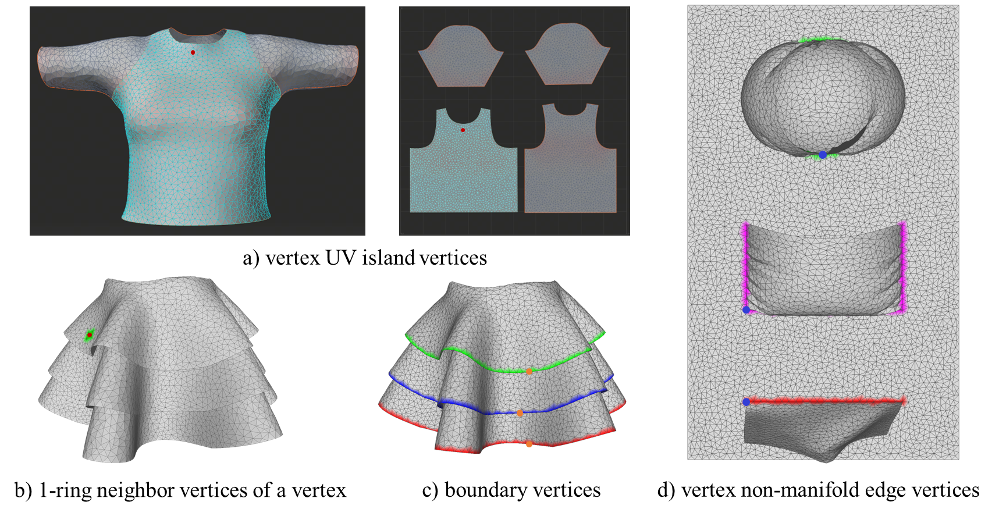
  <p><em>Binding mode examples: (a) UV_ISLAND, (b) NEIGHBOR, (c) BOUNDARY, (d) NONMANIFOLD_EDGES</em></p>
</div>

**Detailed Explanations:**

- **UV_ISLAND (a)**: The red marker point extends to all vertices in the same UV island (shown in green)
- **NEIGHBOR (b)**: The red marker point extends to its 1-ring neighbor vertices (shown in green)
- **BOUNDARY (c)**: Three orange marker points extend to boundary vertices (shown in green, blue, and red)
- **NONMANIFOLD_EDGES (d)**: Three blue marker points extend to vertices with non-manifold edges (an edge that is connected to more than two faces), shown in green, purple, and red

### Attached Indices

The `ATTACHED_INDICES` field specifies reference points for Long-Range Attachment constraints. The algorithm will apply global strain limit between the reference point and all cloth vertices. The marker point should be selected as a cloth vertex that is close to the body during simulation. In practice, we choose one of the marker points defined in the `BINDING` section as the reference point.

### Interactive Annotation

We use MeshLab to select marker points interactively. Follow these steps:

#### Import and Select Marker Points

1. Import the garment mesh using `File → Import Mesh...`
2. Enter **pick mode** by pressing the `Get Info` button
3. Click on the garment mesh to select marker points

<div style="text-align: center;">
  
  <p><em>Selecting marker points</em></p>
</div>

#### Record Vertex Indices

**Important**: Record the vertex indices of all selected marker points. You will need these indices when creating the configuration file.

#### Export the Mesh

Export the mesh as an `.obj` file with the following settings:
   - **Vert**: Check `Normal`
   - **Wedge**: Check `TexCoord`

<div style="text-align: center;">
  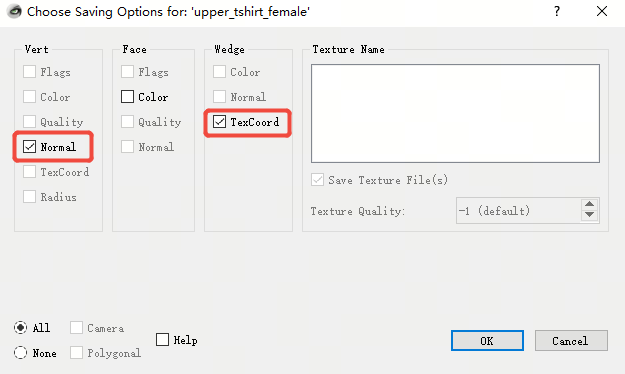
  <p><em>Mesh export settings</em></p>
</div>


The exported mesh file should be named as `{PART}_{TYPE}_{GENDER}.obj` and placed in the appropriate assets folder:

```
Assets/Garment/${BODY_MODEL}/Template/{PART}_{TYPE}_{GENDER}.obj
```

**Example**: For a garment with style `upper_tshirt_female` and body model `SMPL(H)`:
```
Assets/Garment/SMPLH/Template/upper_tshirt_female.obj
```

#### Configuration File Creation

Create a corresponding JSON configuration file:

```
Assets/Garment/${BODY_MODEL}/Config/{PART}_{TYPE}_{GENDER}.json
```

**Example**: For the same garment:
```
Assets/Garment/SMPLH/Config/upper_tshirt_female.json
```

### Configuration File Structure

The configuration file contains all the metadata required for simulation. Here's a complete example:

```json
{
    "STYLE": "upper_tshirt_female",
    "MASS": 1.0,
    "ATTACHED_INDICES": [2443],
    "BINDING": {
        "UV_ISLAND": {
            "INDICES": [1575, 600],
            "STIFFNESS": [1.0, 1.0],
            "DISTANCE": [0.05, 0.05]
        },
        "NEIGHBOR": {
            "INDICES": [
                1177, 1178, 1179, 1180, 1181, 1182,
                1143, 1142, 1141, 1140, 1139, 1138
            ],
            "STIFFNESS": [
                1.0, 1.0, 1.0, 1.0, 1.0, 1.0,
                1.0, 1.0, 1.0, 1.0, 1.0, 1.0
            ],
            "DISTANCE": [
                0.1, 0.1, 0.1, 0.1, 0.1, 0.1,
                0.1, 0.1, 0.1, 0.1, 0.1, 0.1
            ]
        },
        "BOUNDARY": {
            "INDICES": [],
            "STIFFNESS": [],
            "DISTANCE": []
        },
        "NONMANIFOLD_EDGES": {
            "INDICES": [],
            "STIFFNESS": [],
            "DISTANCE": []
        }
    }
}
```

#### Detailed Parameters

| PARAMETER | TYPE | DESCRIPTION | RANGE |
|-----------|------|-------------|-------|
| `STYLE` | String | Garment style following naming convention | `{PART}_{TYPE}_{GENDER}` |
| `MASS` | Float | Vertex mass for simulation | > 0 |
| `ATTACHED_INDICES` | Array | LRA reference point indices | Vertex indices |
| `INDICES` | Array | Marker point vertex indices | Vertex indices |
| `STIFFNESS` | Array | Constraint strength | [0.0, 1.0] |
| `DISTANCE` | Array | Maximum movement distance | > 0 |

#### Example Configuration Breakdown

- **UV_ISLAND**: Marks sleeve vertices (fast-moving areas) with high stiffness
- **NEIGHBOR**: Marks underarm vertices (distinctive body shape areas) with medium stiffness
- **BOUNDARY/NONMANIFOLD_EDGES**: Empty arrays (not used in this example)

### Final Verification

Before testing, double-check that both files are properly placed:

1. **Mesh file**: `Assets/Garment/${BODY_MODEL}/Template/{PART}_{TYPE}_{GENDER}.obj`
2. **Configuration file**: `Assets/Garment/${BODY_MODEL}/Config/{PART}_{TYPE}_{GENDER}.json`

(md-test-the-pipeline)=

## Test The Pipeline

Once your garment asset is properly configured, you can test it in the simulation pipeline.

### Update Simulation Configuration

To use the newly created garment asset, update the `CLOTH_STYLES` field in your simulation configuration:

```json
{
    "PIPELINE_SMPL": {
        "CLOTH_STYLES": ["{PART}_{TYPE}_{GENDER}"]
    }
}
```

**Example**: For a female t-shirt:
```json
{
    "PIPELINE_SMPL": {
        "CLOTH_STYLES": ["upper_tshirt_female"]
    }
}
```

### Run the Simulation

Execute the simulation with your configuration files:

```bash
./XRTailor --simulation_config="./simulation_conf.json" --engine_config="./engine_conf.json"
```