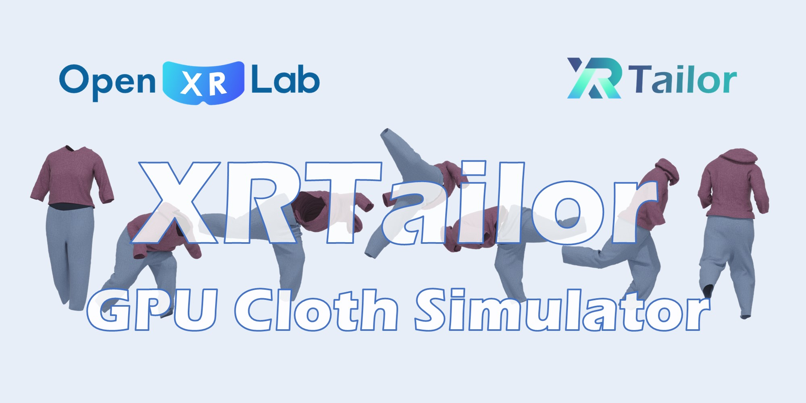

# 🔎 Overview

::::{grid}
:reverse:
:gutter: 3 4 4 4
:margin: 1 2 1 2

:::{grid-item}
:columns: 12 4 4 4

:::

:::{grid-item}
:columns: 12 8 8 8
:child-align: justify
:class: sd-fs-5

```{rubric} XRTailor
```
OpenXRLab GPU Cloth Simulation Engine

````{div} sd-d-flex-row
```{button-ref} getting_started/quick_start
:ref-type: doc
:color: primary
:class: sd-rounded-pill sd-mr-3

Quick Start
```
````
::::

---

<div style="text-align: center;">
  
</div>

## Overview

*XRTailor* is a GPU-accelerated cloth simulation engine optimized for large-scale data generation. By leveraging parallel computing techniques, 
*XRTailor* delivers high-fidelity cloth dynamics while maintaining performance, making it a practical choice for applications in animation, gaming and machine learning dataset synthesis.

## Features

- *Realistic Cloth Mechanics*. *XRTailor* models the physical behavior of fabrics, incorporating key mechanical properties such as stretch, bending, and anisotropy to provide plausible cloth deformation.

- *Collisions*. Collision detection and response are essential for cloth simulation. *XRTailor* supports obstacle-cloth collision, environment-cloth collision and self-collision. These features help maintain natural interactions between cloth and surrounding objects.

- *Fully Parallelized*. To achieve better performance, *XRTailor* employs advanced data structures and algorithms specifically designed for GPU execution. By maximizing parallelism, the engine supports rapid computation, making it suitable for real-time and offline simulations alike.

- *Balanced Performance Modes*. *XRTailor* offers two modes to accommodate different needs:

    - ***Swift Mode***: Optimized for real-time applications, offering rapid simulations with simplified fabric properties and collision handling.

    - ***Quality Mode***: Prioritizes accuracy, delivering highly detailed simulations at the cost of increased computational overhead.

- *Fully Automatic*. Unlike existing cloth simulators, animators do not need to place the cloth pieces in appropriate positions to dress an avatar.

- *Highly Compatible with SMPL(X)*. *XRTailor* supports SMPL, SMPLH, SMPLX with AMASS integration.

- *GLTF Support*. Allows importing mannequins with skeletal animation in GLTF format.

- *Easy to Use*. Traditional cloth simulation workflow is laborious and knowledge intensive. *XRTailor* aims to simplify the process, allowing users to obtain desired outputs (such as Alembic or OBJ sequences) using a single command.

- Simulation as a Service. *XRTailor* is a powerful and scalable platform designed for large-scale data generation. Our simulation service enables users to efficiently create and manage vast amounts of synthetic data. Designed for large-scale synthetic data generation, *XRTailor* can be deployed via Docker, even in headless environments.

- *Multi Platform Support*. *XRTailor* runs on Windows and Linux systems that support CUDA, offering flexibility across computing environments.

- *OpenGL Rendering*. A built-in graphical interface provides visualization and control over the simulation process.

## Architecture

The architecture of *XRTailor* is:

<div style="text-align: center;">
  
  <p><em>Architecture</em></p>
</div>

```{toctree}
:hidden:
:caption: Getting Started
:maxdepth: 2

getting_started/quick_start.md
getting_started/engine_config_example.md
getting_started/simulation_config_example.md
getting_started/build_from_source.md
getting_started/technical_brief.md
```

```{toctree}
:hidden:
:caption: Common
:maxdepth: 2

common/preparing_your_own_asset.md
common/mass_spring_system.md
```

```{toctree}
:hidden:
:caption: Swift Mode
:maxdepth: 2

swift_mode/obstacle_cloth_collision.md
```

```{toctree}
:hidden:
:caption: Quality Mode
:maxdepth: 2

quality_mode/impact_zone_optimization.md
```
