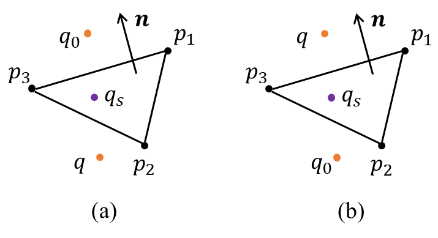
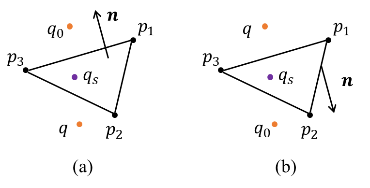
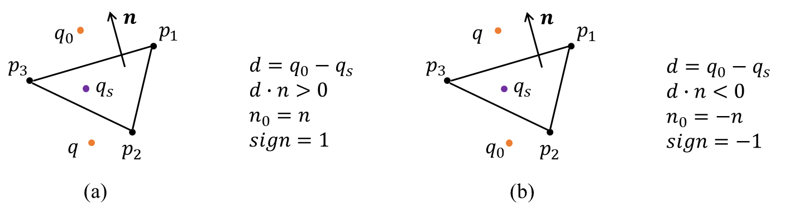

# Obstacle-Cloth Collision

- [DCD](md-dcd)
- [CCD](md-ccd)

In swift mode, the PBD-based collision response scheme is used to handle obstacle-cloth collisions. Specifically, discrete collision detection(DCD) and continuous collision detection(CCD) constraints are incorporated into the simulator.

(md-dcd)=

## DCD

DCD handles collisions at a discrete time step. For triangle meshes, DCD is usually represented as VF(Vertex-Face) and EE(Edge-Edge) collision.

### VF Constraint

#### Object-Cloth

For object-cloth collision, the VF constraint projects the predicted cloth vertex outside the face. The constraint is given by:

```{math}
C(q,p_1, p_2, p_3)=(q-q_s) \cdot n - h \ge 0 \tag{1}
```

where $q$ is the predicted vertex position; $q_s$ represents the nearest point on the face $(p_1, p_2, p_3)$ to $q$; $n$ is the normal of $(p_1, p_2, p_3)$. The following figure demonstrates different cases of the constraint:

<div style="text-align: center;">
  
</div>

$q_0$ is the position of cloth vertex at the beginning of the step. (a) shows that $q$ enters from above the $(p_1, p_2, p_3)$, a constraint will be generated; (b) shows that $q$ enters from below the $(p_1, p_2, p_3)$, no collision will be generated.

Once a collision constraint is generated, a positional update will be added to $q$:

```{math}
\Delta q = ((q - q_s) \cdot n - h) * n = (d - h) * n
```

#### Cloth-Cloth

In object-cloth collision, the obstacle is rigid, so the face normal remains unchanged during simulation. However, in cloth-cloth collision, all vertices are movable, and the face normal may flip depending on the configuration. In the original PBD paper, the self collision constraint is defined as:

```{math}
C(q,p_1, p_2, p_3)= \pm (q-p_1) \cdot \frac{(p_2 - p_1) \times (p_3 - p_1)}{|(p_2 - p_1) \times (p_3 - p_1)|} - h \ge 0
```

where the sign of $n = \pm \frac{(p_2 - p_1) \times (p_3 - p_1)}{|(p_2 - p_1) \times (p_3 - p_1)|}$ is determined by the direction that $q$ enters the face:

<div style="text-align: center;">
  
</div>

(a) shows that $q$ enters from above the face, $n = \frac{(p_2 - p_1) \times (p_3 - p_1)}{|(p_2 - p_1) \times (p_3 - p_1)|}$; (b) tells that $q$ enters from below the face, $n =- \frac{(p_2 - p_1) \times (p_3 - p_1)}{|(p_2 - p_1) \times (p_3 - p_1)|}$. The gradients are:

```{math}
\begin{cases}
\nabla_{q} C(q,p_1,p_2,p_3) = n  \\
\nabla_{p_1} C(q,p_1,p_2,p_3) = \frac{1}{|n|} [(p_3 \times q)+(n \times p_3)(n \cdot q)] \\
\nabla_{p_2} C(q,p_1,p_2,p_3) = \frac{1}{|n|} [(p_2 \times q)+(n \times p_2)(n \cdot q)]  \\
\nabla_{p_3} C(q,p_1,p_2,p_3) = -\nabla_{q} C - \nabla_{p_1} C - \nabla_{p_2} C
\end{cases}
```

The final positional updates are:

```{math}
\begin{cases}
\Delta q = -s * w_0 * \nabla_{q} C \\
\Delta p_1 = -s * w_1 * \nabla_{p_1} C \\
\Delta p_2 = -s * w_2 * \nabla_{p_2} C \\
\Delta p_3 = -s * w_3 * \nabla_{p_3} C
\end{cases}
```

where $s$ is the scaling factor:

```{math}
s=\frac{C(q,p_1,p_2,p_3)}{w_0* |\nabla_{q} C|^2 + w_1* |\nabla_{p_1} C|^2 + w_2* |\nabla_{p_2} C|^2 + w_3* |\nabla_{p_3} C|^2}
```

#### Unified Representation

The object-cloth and cloth-cloth VF DCD can be written as an unified form:

```{math}
C(q,p_1, p_2, p_3)= sign * (q-p_1) \cdot n - h \ge 0
```

with sign:

```{math}
\begin{cases}
sign = 1, n * n_{0} >0 \\
sign = -1, n * n_{0} < 0
\end{cases}
```

where $n_0$ is the original or reference normal direction of the face, used to determine if the vertex enters from the front or back.

<div style="text-align: center;">
  
</div>

***Proof:***

For object-cloth collision, the obstacle is regarded as the rigid body, which are usually treated as having infinite mass. Therefore, their inverse masses are 0:

```{math}
w_1 = w_2 = w_3 \approx 0
```

The scaling factor comes to:

```{math}
s=\frac{C(q,p_1,p_2,p_3)}{w_0* |\nabla_{q} C|^2}=\frac{C(q,p_1,p_2,p_3)}{w_0}=\frac{(q-p_1) \cdot n - h}{w_0}
```

The positional updates are:

```{math}
\begin{cases}
\Delta q = -s * w_0 * \nabla_{q} C = ((q-p_1) \cdot n - h)*n = (d  - h) * n \\
\Delta p_1 = 0 \\
\Delta p_2 = 0 \\
\Delta p_3 = 0
\end{cases}
```

which is equivalent to the positional update in Equation 1:

```{math}
\Delta q = (d - h) * n
```

### EE Constraint

EE constraint is generated between two line segments $(p_0, p_1)$ and $(p_2, p_3)$. The constraint is:

```{math}
C(p_0,p_1, p_2, p_3)= | b_0 * p_0 + b_1 * p_1 - b_2 * p_2 - b_3 * p_3 | - h \ge 0
```

The constraint is defined based on the closest points between the two edges, represented as linear combinations using barycentric weights $(b_0, ..., b_3)$. The gradients are:

```{math}
\begin{cases}
\nabla_{p_0} C = b_0 * n  \\
\nabla_{p_1} C = b_1 * n \\
\nabla_{p_2} C = -b_2 * n \\
\nabla_{p_3} C =  -b_3 * n
\end{cases}
```

The scaling factor:

```{math}
s=\frac{C(p_0,p_1,p_2,p_3)}{w_0* b_0^2 + w_1* b_1^2 + w_2* b_2^2 + w_3* b_3^2}
```

The positional updates:

```{math}
\begin{cases}
\Delta p_0 = -s * w_0 * b_0 * n \\
\Delta p_1 = -s * w_1 *b_1 * n \\
\Delta p_2 = s * w_2 * b_2 * n \\
\Delta p_3 = s * w_3 * b_3 * n
\end{cases}
```

(md-ccd)=

## CCD

We further implemented a simple vertex-face CCD method to detect and resolve collisions within a time interval. We employ a geometric ray-casting method for vertex-face CCD. For each vertex trajectory $q_0 \rightarrow q$, we check for intersection with candidate triangles to generate constraints at the point of intersection:

```{math}
C(q,p_1, p_2, p_3)=(q-q_c) \cdot n - h \ge 0
```

At each time step, ray-triangle intersections are checked to determine whether the line segment $q_0 \rightarrow q$ enters $(p_1, p_2, p_3)$. $q_c$ is the intersection point between the line segment and the face.


CCD and DCD are integrated into the simulation pipeline via an interleaved approach, which means CCD and DCD constraints are applied alongside other PBD constraints during each solver iteration. Since generating collision constraints at each iteration is computationally expensive, we introduce collision passes parameter to reuse the constraints during the solver loop. For more details, please refer to our solver implementation.

## References

[1]: <span name = "ref1">Müller M, Heidelberger B, Hennix M, et al. Position based dynamics[J]. Journal of Visual Communication and Image Representation, 2007, 18(2): 109-118.</span>